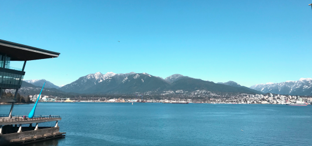

It’s two hours past lunchtime, and you’re starting to feel it - you slowly start to doze off. The mid-day crash has got you feeling all the feels. Sleepiness is a natural response of our bodies after a meal as the digestion process occurs. While we’ve all been there, you don’t want to make it a habit and hinder your work productivity- especially while you are on a co-op work term!

Thinking of curling up in your cubicle? Here are 5 ways (caffeine-free!) to keep energized throughout the day.

### 1. Spice up your hydration by adding a slice of lemon, lime, or mint to your water

Did you know?  Being 3-4% dehydrated can lower your work performance by up to 50%! Which can lead you to become less focused and sleepy when the afternoon hits.  Adding a slice of lemon gives you a boost of vitamin C while adding lime can improve digestion after a meal. If you are not a fan of citrus fruits, a cucumber or a mix of berries might do the trick.

###  2. Get some fresh air

Canada has some of the worlds’ cleanest air and what better way to enjoy it than to go outside! If your coop is located in Downtown Vancouver- great! Head out to waterfront to view spectacular North Vancouver across the water or to Yaletowns’ harbour area along the seawall. When you’re in sync with mother nature and seeing the vibrant colours of Vancouver, take a moment to breathe. Ahhh.

### 3. Organize your surroundings

The places we work, sleep and eat all play a role in our productivity and engagement. De-clutter your desk space and use office supplies like sticky notes and folders to colour coordinate your things. Use a yellow tint screen shader to limit the effects of a harsh computer screen on your eyes. If you’ve got an ergonomic desk, stand up to work during intervals of times.

### 4. Buy an office plant pet 

Indoor plants work to remove toxins and help humidify the room.  There are plenty of options ranging from those that do well in low light to full sun.  Make sure to figure out what would be best for your desk location.  My personal all-around favorite that I kept at my desk was an aloe vera and small succulent- both that required minimal watering.

### 5. Exercise during your lunch hour

Barre, spin, and gym classes are perfect for adding into your daily schedule if your office is in downtown Vancouver. [Classpass] (https://classpass.com) offers tons of drop-ins to studios for up to 70% off studio price. I frequently went to conditioning classes from Pure Barre and free yoga classes from the wellness room at SFU Harbour centre. If you’re not close to a studio, find some green space outside and follow a youtube video or simply take the time to relax. 

Follow these five things, and you’re bound to have a more energized space throughout the day. I worked at the [Real Estate Council of BC](www.recbc.ca) for eight months, and one of my favourite things to enjoy was beautiful Downtown Vancouver.

Read the original post [here] (http://www.sfu.ca/olc/blog/co-op/5-ways-avoid-mid-day-crash-0). 
